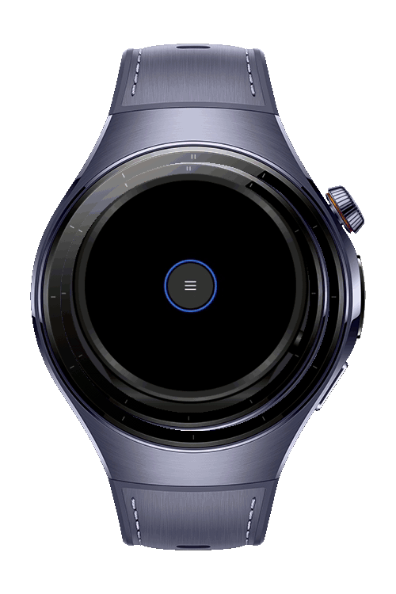
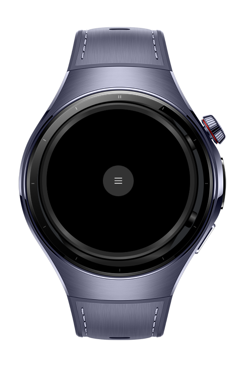
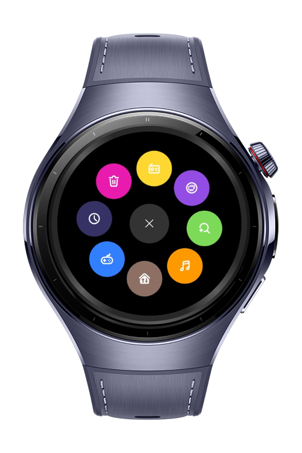

> **Note:** To access all shared projects, get information about environment setup, and view other guides, please visit [Explore-In-HMOS-Wearable Index](https://github.com/Explore-In-HMOS-Wearable/hmos-index).

> **Note:** To access all shared projects, get information about environment setup, and view other guides, please visit [Explore-In-HMOS-Wearable Index](https://github.com/Explore-In-HMOS-Wearable/hmos-index).

# How To Create Radial Menu in Wearable
Radial Menu is a HarmonyOS NEXT wearable device codelab, developed using ArkTS. 
It demonstrates how to implement a circular navigation interface that opens with a button press, providing quick access to functions and apps. 
Built with ArkUI, it showcases smooth, intuitive interaction for smartwatch navigation.

# Preview

<div>
  
  
  
</div>

# Use Cases

- A user can open the Radial Menu with a button press to quickly switch between frequently used apps on their smartwatch.

- The Radial Menu allows users to access and adjust key smartwatch settings like brightness, volume, and notifications with a single button press.

# Tech Stack

**Languages**: ArkTS

**Frameworks**: HarmonyOS SDK 6.0.0(20)

**Tools**: DevEco Studio Version 6.0.0.33

**Libraries**: `@kit.ArkUI`

# Directory Structure

```
entry/src/main/ets/

├── pages
   ├── Radial Menu         
```

# Constraints and Restrictions

## Supported Devices 
           
- Huawei Watch 5

# License

**RadialMenu** is distributed under the terms of the MIT License
See the [LICENSE](./LICENSE) for more information.